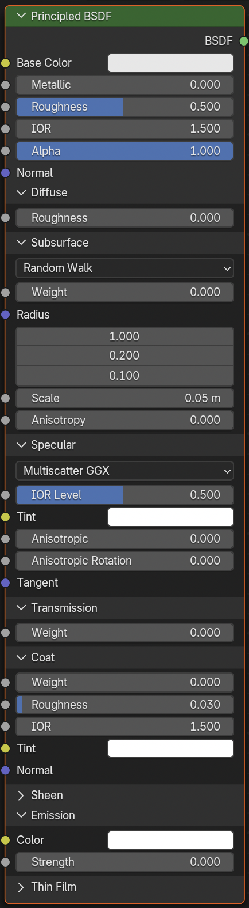

# Principled BSDF

**Namen poglavja:** spoznati material **Principled BSDF** – univerzalni, fizično‑baziran shader v Blenderju – ter ključne drsnike (barva, kovinskost, hrapavost …), povezovanje tekstur (PBR set) in razlike med Eevee in Cycles. Na koncu boš znal/-a iz nič postaviti preprost, realističen material.

---

## Kaj je Principled BSDF?

**Principled BSDF** je "vse‑v‑enem" shader, zasnovan po t. i. *Disney PBR* modelu.  
Zajema najpogostejše fizikalne lastnosti površin (kovinskost, hrapavost, prosojnost …) in omogoča konsistenten izgled v različnih render pogonih.

> Ideja: namesto kombiniranja več shaderjev (Diffuse/Glossy/Glass…) nastaviš **en shader** z nekaj razumljivimi parametri.

---

## Ključni parametri (najbolj uporabni)

- **Base Color** – osnovna barva (tekstura ali ročna barva).  
- **Metallic** – kovinskost (0 = nekovina, 1 = kovina).  
- **Specular** – intenziteta spekularnega odboja (povezana z IOR; privzeto 0.5 je dober kompromis).  
- **Roughness** – hrapavost mikro‑površine (0 = ogledalo, 1 = zelo mat).  
- **Normal** – vhod za **Normal Map** (podrobnosti reliefa brez prave geometrije).  
- **Clearcoat** & **Clearcoat Roughness** – dodatna, tanka “lak” plast (npr. lakiran avtomobil).  
- **Transmission** & **IOR** – prosojnost in lom svetlobe (steklo, tekočine).  
- **Subsurface** & **Subsurface Radius/Color** – **SSS** (podpovršinski sip svetlobe; koža, vosek, mleko).  
- **Sheen** – rahla “tkaninska” komponenta (mat tkanine).  
- **Emission** – lastna svetloba (LED, zasloni, neoni).  
- **Alpha** – prekrivnost (npr. listi, nalepke; zahteva nastavitev v materialnih *Settings*).

{ width="30%" data-gallery="principled" }

Na sliki so prikazani vsi našteti omenjeni pomembni parametri **PrincipledBSDF**.

---

## Hiter potek: od nič do materiala

1. **Ustvari material**: izberi objekt → *Material Properties* → **New** (vidiš “Principled BSDF” → “Material Output”).  
2. **Nastavi osnovo**: prilagodi **Base Color** in **Roughness** (npr. les = višja roughness, kovina = Metallic ~1, Roughness manjša).  
3. **Dodaj teksture (po želji)**: Base Color, Roughness, Metallic, Normal… (glej spodaj).  
4. **Osvetlitev & pogled**: vklopi **Material Preview** ali dodaj preprost **HDRI**/luči za boljši občutek materiala.

---

## PBR teksturni set (priporočeno)

Tipičen PBR paket vključuje vsaj:
- **Base Color / Albedo** (barvna tekstura) → **Color Space = sRGB**  
- **Roughness** (sivinska) → **Non‑Color**  
- **Metallic** (sivinska) → **Non‑Color**  
- **Normal** (modrikasta) → **Non‑Color** (prek **Normal Map** noda v **Normal** vhod)  
- *(po želji)* **Height/Displacement** → **Non‑Color** (prek *Bump* ali *Displacement*; za pravo višinsko izrivanje rabiš Cycles in *Displacement* v materialnih nastavitvah)

!!! tip "Barvni prostori"
    Pravilo: **barvne** teksture (albedo/base color) = **sRGB**; **podatkovne** (roughness, metallic, normal, height) = **Non‑Color**.

---

## Eevee vs Cycles (na kratko)

- **Eevee** – hiter *real‑time*; za steklo/refrakcije omogoči **Screen Space Reflections** (*Render Properties*) in v materialu *Settings* omogoči **Blend Mode** (*Alpha Blend/Hashed*) ter **Screen Space Refraction** (če želiš realističnejši videz).  
- **Cycles** – bolj fizično natančen; displacement deluje “pravo” pri vklopljenem **Displacement** (Material Properties → *Settings* → *Displacement: Displacement Only/Displacement and Bump*).

---

## Vaja (10–15 min)

1. Ustvari **UV Sphere** in ji dodaj nov material.  
2. Nastavi **Metallic = 1.0** in se igraj z **Roughness** (0.05–0.6); opazuj odboje.  
3. Uvozi PBR set (BaseColor/Roughness/Metallic/Normal) za kovinski material (npr. “brushed metal”) in ga poveži kot zgoraj.  
4. Preizkusi **Clearcoat** (0.2–0.5) z malo **Clearcoat Roughness** za “lak”.  
5. Podvoji sfero in na drugi uporabi **Transmission + IOR ~1.45** (steklo); primerjaj v Eevee in Cycles.

---

## Težave & rešitve

??? question "Tekstura izgleda sprana/siva"
    Verjetno je **Color Space** napačen. Barvna tekstura mora biti **sRGB**, podatkovne (**Roughness/Metallic/Normal**) pa **Non‑Color**.

??? question "Vijoličen material"
    Manjka pot do teksture ali datoteka ni najdena. Odpri Image Texture node in ponovno izberi datoteko.

??? question "Normal mapa deluje obrnjeno"
    V **Normal Map** node preklopi **Space** (OpenGL ↔ DirectX) ali zamenjaj/zrcali **Green (Y)** kanal v urejevalniku.

??? question "Steklo v Eevee ne izgleda pravilno"
    V *Render Properties* vključi **Screen Space Reflections**, v materialu (Settings) nastavi **Blend Mode** (*Alpha Blend/Hashed*) in vklopi **Screen Space Refraction**; prilagodi **Roughness**/**IOR**.

---

## Rezultat

Znaš ustvariti material s **Principled BSDF**, razumeš **Metallic/Roughness** model, pravilno priklopiš **PBR teksture** (s pravimi barvnimi prostori) in poznaš osnovne razlike **Eevee vs Cycles**. Pripravljen/-a si za naslednje poglavje o **vozliščih in UV‑mapiranju**.

[**Naprej → Vozlišča & UV**](vozlisca-in-uv.md){ .md-button .md-button--primary }
[← Nazaj: Orodja](../osnove-modeliranja/orodja.md){ .md-button }
