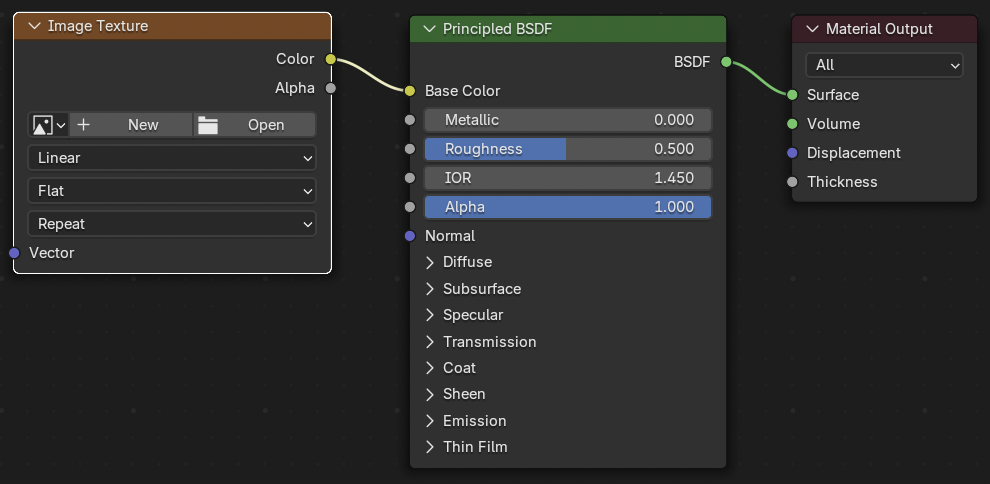
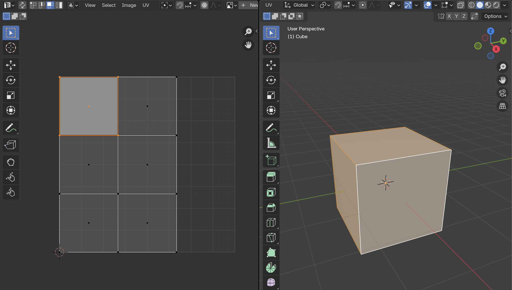

# Vozlišča in UV mapiranje

**Namen poglavja:** razumeš, kako v Blenderju deluje **sistem vozlišč (nodes)** v **Shader Editorju**, kako **povezujemo teksture** ter kako poteka **UV‑mapiranje** – pretvorba 3D površine v 2D prostor. Naučil/-a se boš tudi, kako ročno popraviš UV-e in uporabiš **Smart UV Project**.

---

## Shader Editor in vozlišča

**Shader Editor** (včasih “Node Editor”) je orodje za sestavljanje materialov z uporabo **vozlišč (nodes)**.

### Kako ga odpreti:
- V spodnjem ali stranskem delu vmesnika zamenjaj enega izmed oken → **Shader Editor**
- Prepričaj se, da ima objekt material; izberi ga → *Material Properties* → **New**

### Osnovna struktura vozlišč:
- **Image Texture** → vhodna tekstura (slika)
- **Principled BSDF** → glavni shader
- **Material Output** → rezultat (gre v render)

Na spodnji sliki so prikazana vozlišča. V vozlišču Material Output kliknemo **New** ali **Open** in izberemo sliko.

{ width="80%" data-gallery="vozlisca" }

---

## Povezava tekstur

Vozlišča povezuješ z “vrvicami” – vlečeš iz izhodov (output) v vhode (input). Pazi na barve:
- **Sivi priključki** = enodimenzionalna vrednost (npr. Roughness, Metallic)
- **Rumeni** = barvni vektor (RGB), npr. Base Color, Emission
- **Modri** = normalni vektorji (Normal Map, Tangent)

### Primer:
1. Dodaj **Image Texture**: `Shift + A` → Texture → Image Texture  
2. Klikni *Open* → izberi sliko (npr. `wood_basecolor.jpg`)
3. Povleci izhod **Color** (rumen) v **Base Color** Principled BSDF

> Če priključiš teksturo v napačen tip vhoda (npr. barvno sliko v Roughness), bo material videti napačno.

!!! tip "Organizacija nodov"
    - Z **Frame** node lahko obkrožiš več vozlišč (Shift + A → Layout → Frame)
    - Z **Reroute** node urediš potek povezav (Shift + Right-click na povezavi → Reroute)

---

## UV mapiranje – kaj in zakaj?

**UV mapiranje** pretvori 3D površino objekta v **2D koordinatni sistem (U in V)**, ki določa, katera točka slike se prikaže na kateri točki objekta.

Blender vsakemu objektu (mesh) dodeli **UV Map**, ki jo lahko:
- **ustvariš sam** (ročno ali avtomatsko),
- **urejaš v UV Editorju**,
- uporabljaš za prikaz tekstur preko vozlišč (Image Texture).

Na spodnji sliki je prikazano **UV mapiranje** kocke po zgornjem postopku.

{ width="100%" data-gallery="vozlisca" }

---

## Smart UV Project (enostavna razgrnitev)

1. Izberi objekt → *Edit Mode*  
2. Izberi vse (`A`)  
3. *U* → **Smart UV Project**  
4. V oknu potrdi z *OK*

V ozadju Blender razgrne mrežo kot “škatlo” in poskuša razporediti dele mreže v 2D prostor brez prekrivanja. Idealno za začetnike ali teksture brez natančne poravnave.

---

## UV Editor: pregled in uporaba

Odpri **UV Editor** v ločenem oknu.

### Glavne funkcije:
- **Prikaz razgrnitve (UV layout)** – vidiš, kako se 3D ploskve “raztegnejo” v 2D.
- **Urejanje**: prestavljanje, skaliranje, rotacija posameznih UV-ov
- **Prikaz teksture** v ozadju – omogoča ročno prilagajanje poravnave

!!! note "Sliko prikažeš z"
    V UV Editorju → *Image → Open* → izberi teksturo (mora biti enaka kot v Image Texture v Shader Editorju)

---

## Primer: lesena škatla

1. Dodaj **Cube**, pojdi v *Edit Mode*  
2. Uporabi **Smart UV Project**  
3. Odpri **wood_basecolor.jpg** v UV Editorju (npr. iz [ambientCG](https://ambientcg.com/){ target=_blank }) 
4. V Shader Editorju:
    - dodaj **Image Texture** z isto sliko
    - poveži v **Base Color**  
5. Vklopi **Material Preview** in preveri, ali se tekstura pravilno prikaže

[Prenesi `.blend` datoteko z rešitvijo (lesena škatla)](../assets/blend/Example_wood.blend){ target=_blank }

> Če so deli objekta raztegnjeni, lahko v UV Editorju posamezne UV “islands” popraviš ročno (S za skalo, R za rotacijo, G za premik).

---

## Težave & rešitve

??? question "Tekstura se ne prikaže"
    Preveri:
    - Ali imaš objekt **material** z Image Texture?
    - Ali imaš **UV mapo**? (če ne, uporabi *Smart UV Project*)
    - Ali je priključen **Color → Base Color**?

??? question "Tekstura je raztegnjena"
    UV-i so neenakomerno razporejeni. Popravi razmerje ročno v UV Editorju ali uporabi **Average Islands Scale**.

??? question "Napačna stran ima teksturo"
    UV mapa je morda napačno obrnjena. Izberi UV-e in rotiraj jih v UV Editorju (R).

??? question "UV Editor prazen"
    Izberi objekt → *Edit Mode* → izberi ploskve (npr. A). Če še ni UV mape, uporabi *U → Smart UV Project*.

---

## Vaja (10–15 min)

1. Dodaj **UV Sphere** in nov material  
2. Uporabi **Smart UV Project**  
3. Uvozi teksturo (npr. `earth_map.jpg`)  
4. Priključi jo v **Base Color**  
5. V UV Editorju preveri, če se “zemlja” lepo porazdeli  
6. Poskusi ročno premakniti UV dele, da popraviš poravnavo

---

## Rezultat

Razumeš, kako uporabljamo **vozlišča (nodes)** za ustvarjanje materialov, kako **teksture povežemo** z materialom in kaj pomeni **UV razgrnitev**. Znaš uporabiti **Smart UV Project**, najti napake in jih ročno popraviti. Pripravljen/-a si za naslednji sklop – **osvetljevanje in kamera**.

[**Naprej → Osvetlitev & kamera**](../render/osvetljevanje.md){ .md-button .md-button--primary }
[← Nazaj: Principled BSDF](principled-bsdf.md){ .md-button }
