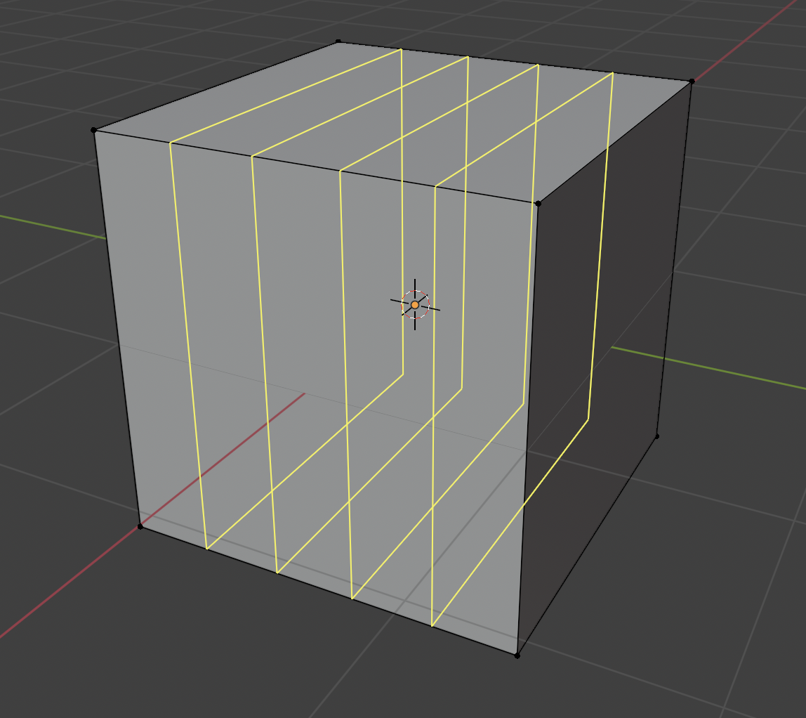
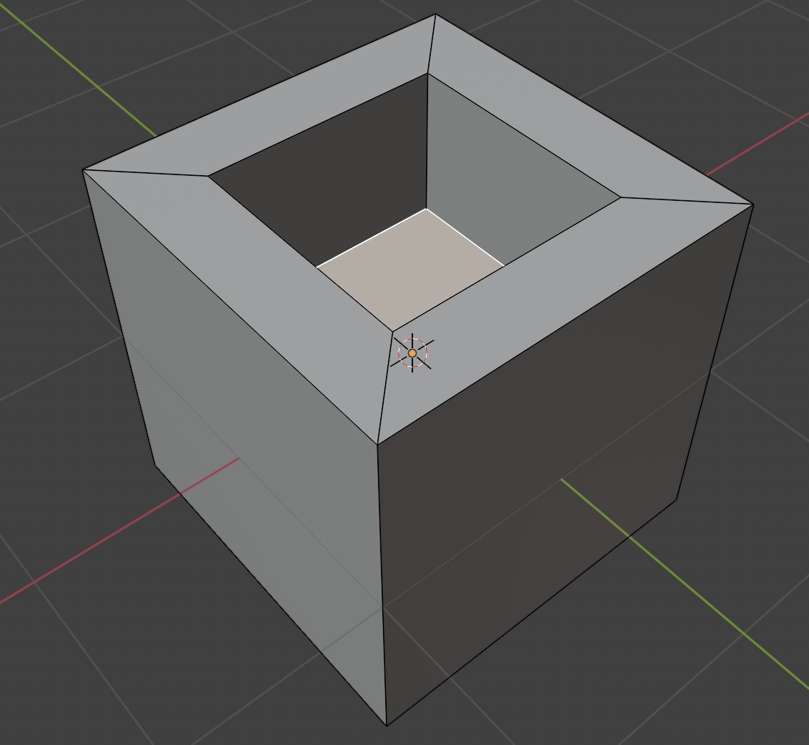
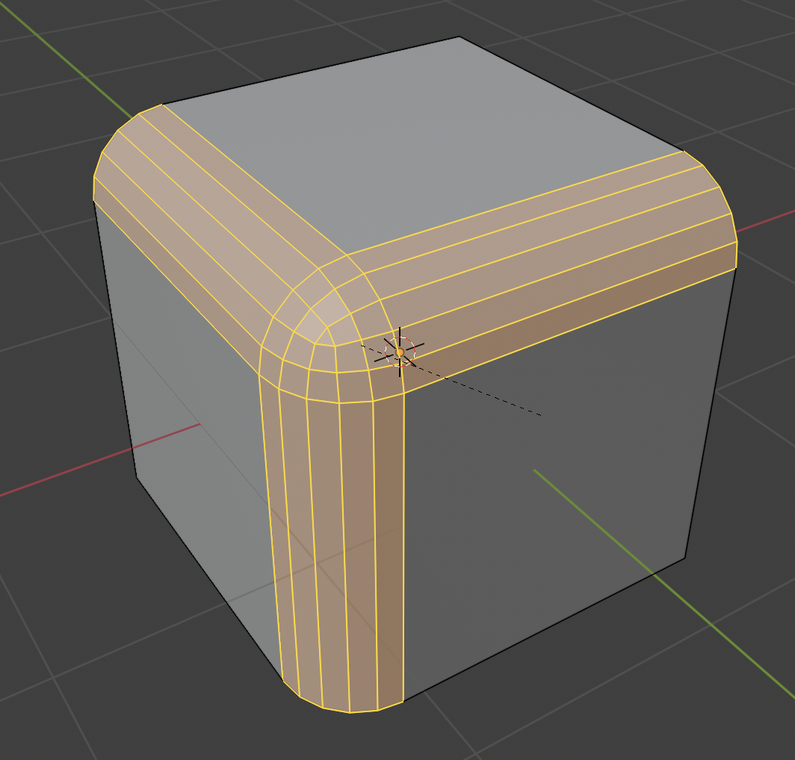
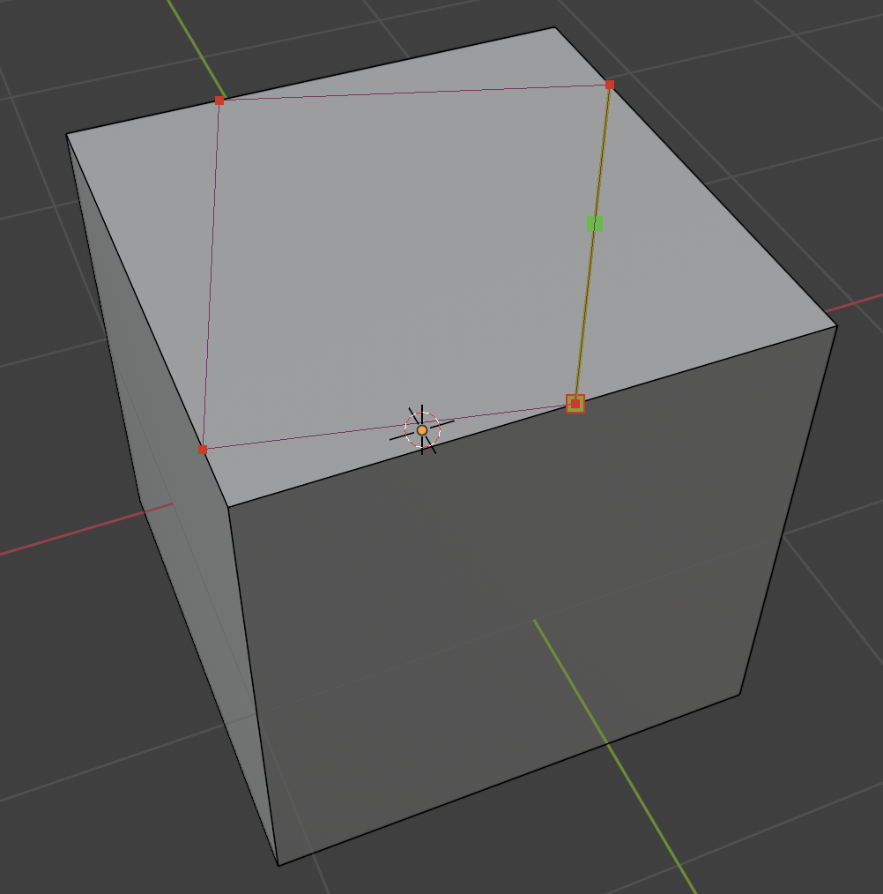

# Modelirna Orodja

**Namen poglavja:** spoznaš ključna modelirna orodja v *Edit Mode* in osnovne principe, da zgradiš obliko iz preprostih primitivov. Po koncu boš znal/-a smiselno dodajati in odvzemati geometrijo, ustvariti reže/zanke, izrivati ploskve in čistiti topologijo.

---

## Izbor komponent (Vertex / Edge / Face)

V *Edit Mode* lahko urejaš:
- **Vertex Select** – oglišča,
- **Edge Select** – robove,
- **Face Select** – ploskve.

Ikone so v zgornji vrstici Viewporta. Preklapljaš tudi s **1/2/3** (na zgornji številski vrstici tipkovnice).

!!! tip "Kombinirani izbor"
    Z **Shift** dodajaš/odštevaš iz selekcije.  
    Z **Alt + LMB** izbereš **edge loop** (celoten obroč robov) v *Edge Select*.

---

## Loop Cut (`Ctrl + R`)

Doda **zanko robov** (edge loop), s katero nadzoruješ tok geometrije in gostoto ploskev.

1. Pritisni **Ctrl+R** (prikaže se predogled z rumeno linijo).  
2. Premakni miško na želeno ploskev/rob (Blender predlaga smer).  
3. Klikni za potrditev in **povleci** za pomik reza; klik/Enter za zaključek.  
4. Z **miškinim koleščkom** pred potrditvijo dodaš več paralelnih rezov.

Na sliki je prikazana uporaba orodja s štirimi zankami.

{ data-gallery="orodja", width="500" }

> Loop Cut je osnova za dodajanje detajlov in za “ostrino” pri Subdivision (support loops).

---

## Extrude (`E`)

**Izrivanje** ustvari novo geometrijo iz obstoječega izbora.

- **E** → povleci z miško (ali vpiši številko).  
- **Along Normal** (privzeto pri ploskvah) izrine pravokotno na ploskev.  
- **Region vs. Individual**: v meniju *Face → Extrude Faces → Extrude Individual Faces* izrine vsako ploskev posebej.

!!! warning "Pazi na notranje ploskve"
    Če extrudaš **navznoter** in nato prekrivaš ploskve, lahko nastanejo *samopreseki*. To kasneje povzroča artefakte pri senčenju.

---

## Inset Face (`I`)

Naredi **notranji okvir** izbrane ploskve/ploskev – odlično za panel linije, okvirje, mesta za gumbe, itd.

- **I** → povleci (nastavi *Thickness*); z **miškinim koleščkom** dodaš *Edge Rail*/segmente.  
- Pridružuje se **Extrude**: pogosto narediš najprej *Inset*, nato *Extrude* navznoter/ven.

Na sliki je prikazan rezultat kombinacija uporabe **Inseta** in **Extruda**.

{ data-gallery="orodja", width="500" }

---

## Bevel robov (`Ctrl + B`) in oglišč (`Ctrl + Shift + B`)

Zaokroži robove (ali “odreže” oglišča) in doda segmente:

- **Ctrl + B** v *Edge Select* – povleci za širino; kolesce za **segmente**.  
- **Ctrl + Shift + B** v *Vertex Select* – *Vertex Bevel*.  
- Profil zaokrožitve (ostrejši/ploščatejši) lahko spremeniš s **P** (profile).

Na sliki je prikazana uporaba orodja **Bevel** s štirimi segmenti.

{ data-gallery="orodja", width="500" }

!!! tip
    *Bevel* na robovih je ključen za realističen “odboj svetlobe” – popolnoma ostri robovi v resnici ne obstajajo.

---

## Knife (`K`)

**Ročno rezanje** mreže (kjer Loop Cut ne zagrabi).

- **K** → klikaj po ploskvah (dodaja rezne točke), **Enter** za potrditev.  
- **C** omeji rez na **kotne skoke** (npr. 45°), **Z** reže “skozi” (Cut through), **E** začne novo rezanje brez potrditve.

Na sliki je prikazana uporaba orodja **Knife** za popolnoma poljuben lik.

{ data-gallery="orodja", width="500" }

---

## Subdivide

Doda **rezalne točke** in razdeli izbrano geometrijo na manjše dele.

- Desni klik (RMB) → **Subdivide** → nastavi **Number of Cuts** v spodnjem levem *Adjust Last Operation* panelu.  
- Uporabi za **enakomerno** dodajanje detaljev na večjem območju.

---

## Merge (`M`) in Cleanup

- **M** (*Merge*) združi izbrana oglišča/robove/ploskve v eno točko:
  - **At Center**, **At Cursor**, **By Distance** (združi preblizu točke – “remove doubles”).  
- **Dissolve** vs. **Delete** (**X**):  
  - **Dissolve** odstrani elemente, a **ohrani** površino (brez lukenj).  
  - **Delete** odstraní in pusti **luknjo** (ustrezno pri resni odstranitvi geometrije).

---

## Proportional Editing (`O`)

Omogoča **mehke transformacije** – vpliv pada z razdaljo. Odlično za *organics* in velike oblike.

- Vključi/izključi z **O** (ikona kroga).  
- Izberi **Falloff** (Smooth/Sharp/…); med transformacijo **miškino kolesce** spreminja polmer vpliva.

---

## Kratka vaja (10–15 min)

1. Dodaj **Cube** in preklopi v *Edit Mode*.  
2. Uporabi **Loop Cut** (2 rezi) za razdelitev na 3 segmente.  
3. Izberi zgornje ploskve → **Inset** (nizek *Thickness*).  
4. Naredi **Extrude** navznoter (plitek).  
5. Označi sprednje vertikalne robove in dodelaj **Bevel** (2–3 segmenti).  
6. Z **Knife** nariši diagonalo na eni strani in **Subdivide** drugo stran za enakomerno gostoto.  
7. Po potrebi **Dissolve** preveč robov in **Merge by Distance** za čiščenje.

---

## Težave & rešitve

??? question "Loop Cut ne zagrabi v pravo smer"
    Preveri topologijo – *ngoni* ali trikotniki lahko prekinejo obroč robov. Poskusi rezati na drugi ploskvi ali uporabi **Knife**.

??? question "Po Extrude se pojavi nenavadno senčenje"
    Verjetno so nastale **prekrivne ploskve** (dvojna geometrija). Razveljavi in extrudaj v pravo smer; po potrebi **Merge by Distance**.

??? question "Bevel ne naredi ničesar"
    Preveri, da so izbrani **robovi** (ne ploskve) in da je **offset** > 0. Če je geometrija že zelo gosta ali samopresečna, najprej **očisti** mrežo.

??? question "Dissolve mi podre obliko"
    Uporabi **Delete** (ne *Dissolve*) kadar želiš res zvrtati luknjo. *Dissolve* ohranja površino in le odstrani robove/ločnice.

---

## Rezultat

Znaš uporabljati **Loop Cut, Extrude, Inset, Bevel, Knife, Subdivide, Merge** in razlikovati med **Dissolve** ter **Delete**. Obvladaš tudi **Proportional Editing** za mehke oblike. Pripravljen/-a si za naslednji sklop – **Materiali**.

[**Naprej → Materiali: Principled BSDF**](../materiali/principled-bsdf.md){ .md-button .md-button--primary }
[← Nazaj: Transformacije](transformacije.md){ .md-button }
