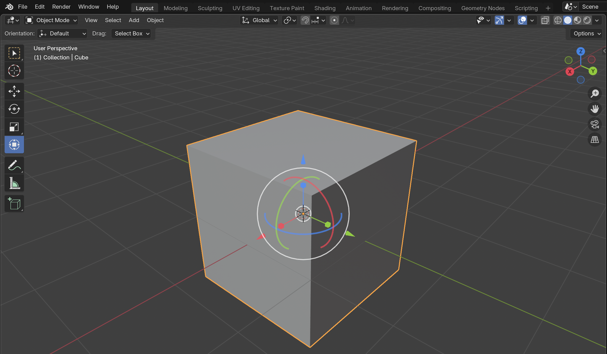

# Transformacije

**Namen poglavja:** spoznaš tri osnovne transformacije v Blenderju – **premik (Move)**, **rotacijo (Rotate)** in **skaliranje (Scale)** – ter ključne pojme: **osi in omejitve**, **numerični vnos**, **orientacije**, **pivot točke**, **3D‑kazalec** in **snapping**. Na koncu boš znal/-a predmet natančno postaviti in pripraviti sceno za nadaljnje modeliranje.

---

## Osnovne transformacije: G / R / S
Vedno moramo najprej izbrati predmet za transformacijo. Nato začnemo s transformiranjem z ustrezno bližnjico:

- **G – premik (Move):** pritisni **G** in povleci z miško.  
  Omeji na os s pritiskom **X**, **Y** ali **Z** (npr. `G`, `X`).  
  Omeji na ravnino s **Shift+os** (npr. `G`, **Shift+Z** premika po XY).

- **R – rotacija (Rotate):** `R`, nato **X/Y/Z** (npr. `R`, `Z` vrti okoli Z).

- **S – skala (Scale):** `S`, nato **X/Y/Z** ali **Shift+os** za izključitev osi  
  (npr. `S`, **Shift+Z** skala le po X in Y).

**Natančni vrednosti:** po ukazu preprosto **vpiši številko** in potrdi z **Enter**  
(npr. `G`, `X`, **1.5**, *Enter*; `R`, `Z`, **90**, *Enter*; `S`, `X`, **0.5**, *Enter*).

{ data-gallery="transformacije" }

Na sliki so prikazane vse možne deformacije. Prav tako je vredno opaziti, da je orientacija transformacije nastavljena na **Global**,
**Snapping** z magnetom pa izklopljen.

!!! tip "Začasni snapping"
    Med premikanjem drži **Ctrl** za začasni snapping (koraki mreže).  
    Trajni snapping vključiš z ikono **magnet** v vrhu Viewporta (glej spodaj).

---

## Orientacija osi: Global / Local / Normal / View

Transformacije lahko potekajo v različnih **orientacijah** (spustni seznam v zgornji vrstici Viewporta):
- **Global** – svetovne osi (X rdeča, Y zelena, Z modra).
- **Local** – osi objekta; če je objekt rotiran, se njegova **lokalna** X/Y/Z razlikuje od globalne.
- **Normal** – os pravokotna na izbrano ploskev/rob (v *Edit Mode*).
- **View** – glede na tvoj pogled (kamera/viewport).

> Primer: rotiran valj ima svoj **Local Z** še vedno vzdolž valja, čeprav globalni Z kaže navpično.

---

## Pivot točke (središče transformacije)

**Pivot** določa, okoli katere točke se vrti/skalira objekt ali izbor. Najpogostejše možnosti (v spustnem meniju Pivot v zgornji vrstici):

- **Median Point** – privzeto; središče izbranih elementov.
- **Individual Origins** – vsak izbrani objekt/element se transformira okoli lastnega središča.
- **3D Cursor** – transformacije potekajo **okoli 3D‑kazalca** (glej spodaj).
- **Active Element** – okoli trenutno aktivnega (svetlejše obarvan) v izboru.

---

## 3D‑kazalec in točka izvora (3D Cursor & Origin)

- **3D Cursor** prestaviš z **Shift + desni klik** (RMB). Uporaben je kot **pivot** ali kot **mesto dodajanja** novih objektov.
- **Origin** (izvor) je referenčna točka objekta (vpliva na vrtenje, skalo, poravnavo).  
  Spreminjaš ga prek *Object → Set Origin* (npr. **Origin to Geometry** ali **Origin to 3D Cursor**).

!!! note "Dodajanje na 3D‑kazalec"
    Mesto dodajanja novih objektov je v meniju **Add → Use 3D Cursor** (če želiš, da se novi objekti pojavijo točno tam, kjer je kazalec).

---

## Snapping (poravnava na mrežo ali elemente)

Vklopi z ikono **magnet** (zgoraj). Način izberi v spustnem seznamu:
- **Increment** (koraki mreže),  
- **Vertex / Edge / Face** (poravnava na oglišča, robove, ploskve),  
- **Volume** (v/na volumen).

Dodatne možnosti: **Align Rotation to Target** (da se ob rotaciji poravna kot tarča).  
Med transformacijo drži **Ctrl** za začasen vklop (tudi če je magnet izklopljen).

---

## Primer: isti rezultat z GUI ali `bpy`

=== "GUI"
    - Postavi kocko **1.5** enote po X: `G`, `X`, `1.5`, *Enter*.  
    - Zavrtí **90°** okoli Z: `R`, `Z`, `90`, *Enter*.  
    - Pomanjšaj za **50 %** po Z: `S`, `Z`, `0.5`, *Enter*.

=== "Python"
    ```python
    import bpy

    obj = bpy.context.active_object  # izberi objekt v sceni
    if obj:
        # premik
        obj.location.x += 1.5
        # rotacija (v radianih: 90° = 1.5708)
        from math import radians
        obj.rotation_euler.z += radians(90)
        # skala po Z
        obj.scale.z *= 0.5

        bpy.context.view_layer.update()
    ```

---

## Težave & rešitve

??? question "Premikam pogled namesto objekta"
    Če se premika **kamera/pogled**, nisi v transformaciji objekta. Izberi objekt, pritisni **G/R/S** (ne **MMB/Shift+MMB**) in pazi na ikone v statusni vrstici.

??? question "Transformacije “skačejo” po korakih"
    Vklopljen je **snapping** (*magnet*). Izklopi magnet ali drži **Ctrl** le, ko to želiš.

??? question "Skaliranje se obnaša čudno v modifikatorjih"
    Ko je objekt nestandardno skalan (npr. `scale: 0.25, 2, 1`), nekateri modifikatorji (npr. Subdivision, Array) ter fizika ne delujejo intuitivno.  
    Rešitev: v **Object Mode** uporabi **Object → Apply → Scale** (bližnjica `Ctrl + A` → *Scale*).

??? question "Vrti se okoli čudne točke"
    Preveri **Pivot** (zgoraj). Morda je na **3D Cursor**. Nastavi nazaj na **Median Point** ali premakni kazalec.

---

## Vaja (5–10 min)

1. Ustvari nov projekt in pusti privzeto kocko.  
2. Premakni jo **2** enoti po Y, zavrti **45°** okoli Z, pomanjšaj po X na **0.5**.  
3. Nastavi orientacijo na **Local** in poskusi rotacijo okoli lokalne osi.  
4. Premakni **3D Cursor** na poljubno mesto in nastavi **Pivot = 3D Cursor**; zavrti kocko okoli kazalca.  
5. Vklopi **snapping = Increment** in poravnaj kocko nazaj na mrežo.

---

## Rezultat

Poznaš **G/R/S**, osne omejitve in natančen vnos, razumeš **orientacije**, **pivot**, **3D‑kazalec** ter **snapping**. Pripravljen/-a si na naslednje poglavje o **modelirnih orodjih**.

[**Naprej → Orodja**](orodja.md){ .md-button .md-button--primary }
