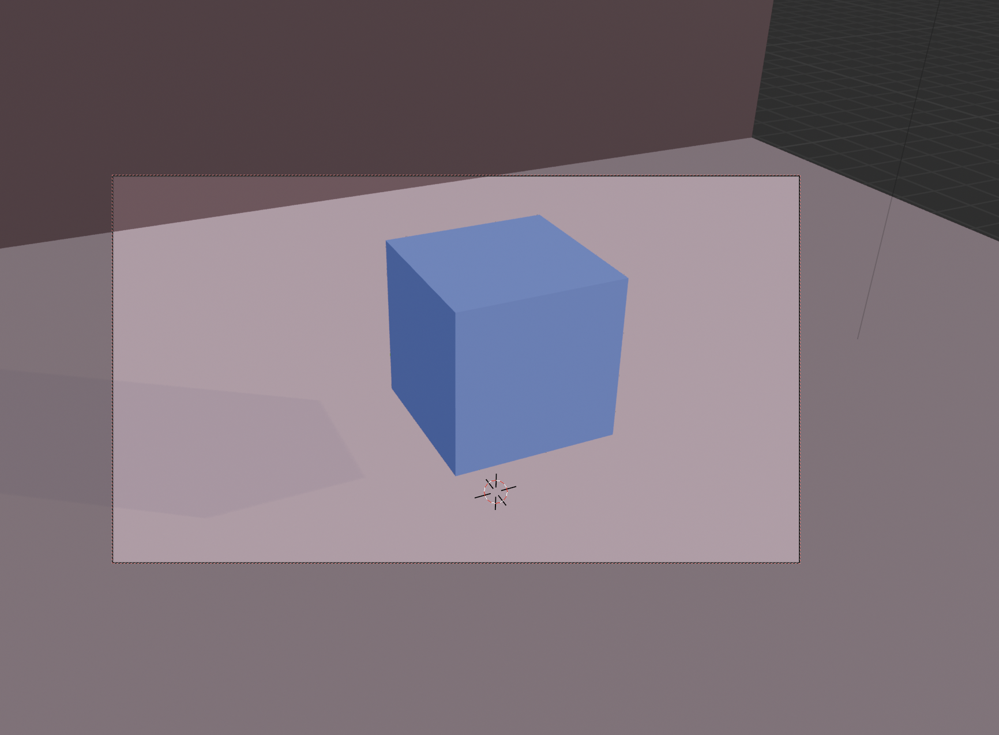

# Kamera & render

**Namen poglavja:** spoznati, kako deluje **kamera v Blenderju**, kako jo pravilno postavimo, okvirjamo prizor in kako nastavimo osnovne parametre renderiranja za kakovostne slike ali videoposnetke.

---

## Kamera – osnovno

Kamera v Blenderju deluje kot resnična filmska kamera: določa **goriščno razdaljo, globinsko ostrino (DOF), pogled**, itd.

### Dodajanje kamere:
`Shift + A → Camera`

### Pregled:
- Izberi kamero → *Object Data Properties* (ikona kamere)
- Tipične vrednosti:
  - **Focal Length**: 35 mm (klasični zorni kot)
  - **Sensor Size**: običajno 36 mm
  - **Clip Start/End**: kako blizu/daleč kamera "vidi"

---

## Gledanje skozi kamero

- `Numpad 0` → preklopi na pogled iz kamere
- `Shift + ` (Tilda) → prost let skozi sceno (Fly Mode)
- `Ctrl + Alt + Numpad 0` → premakne kamero na trenutni pogled
- `G + G` → premik kamere po njeni osi
- `R + R` → rotacija okoli svoje osi

Pogled skozi kamero:
{ width="80%" data-gallery="render" }

---

## Postavitev scene in kompozicija

Dobro postavljena kamera:
- uporablja **pravilo tretjin**
- ne reže ključnih delov objekta
- vključuje globino (npr. z ozadjem, sencami ali DOF)

### Prikaz mreže za kompozicijo:
1. Izberi kamero → *View* → vključi **Composition Guides**
2. Izberi npr. **Thirds** ali **Golden Ratio**

---

## Globinska ostrina (Depth of Field)

DOF omogoča zameglitev ozadja (kot pri pravih kamerah).

1. Izberi kamero → *Object Data Properties*
2. Razširi **Depth of Field**
3. V polje **Focus Object** izberi tisti objekt, ki naj bo oster
4. Zmanjšaj **F‑Stop** (npr. 1.2–2.8) za večjo zameglitev

---

## Render nastavitve (slika)

Pojdi v *Render Properties* in *Output Properties*:

### Render Properties:
- **Render Engine**: Eevee ali Cycles
- **Sampling**:
  - Eevee: 64–128
  - Cycles: 64–512 (odvisno od kakovosti)
- **Denoising**: ON (Cycles)

### Output Properties:
- **Resolution**: npr. 1920×1080 px
- **Frame Start/End**: če delaš animacijo
- **Output Path**: kam se shrani
- **File Format**:
  - Slika: PNG, JPEG
  - Animacija: FFmpeg → MPEG4 (video)

---

## Shrani render

### Ena slika:
1. *F12* → render
2. *Image → Save As*

### Video:
1. Nastavi *Output Format = FFmpeg / MPEG4*
2. Klikni *Render → Render Animation* (ali `Ctrl + F12`)
3. Video se shrani v Output mapo

---

## Vaja: render slike

1. Postavi **kroglo ali škatlo**, dodaj material
2. Dodaj **tri luči** (3‑točkovna osvetlitev ali HDRI)
3. Dodaj **kamero**
4. Nastavi pogled (`Ctrl + Alt + Num 0`)
5. Vključi **DOF** (fokus na objekt, F‑Stop ~1.8)
6. Renderiraj v **Cycles z Denoising**
7. Shrani kot `.png`

---

## Težave & rešitve

??? question "Kamera ne prikazuje nič"
    - Preveri, ali si v pogledu kamere (`Num 0`)
    - Morda je kamera usmerjena stran od objekta

??? question "Render je temen"
    - Preveri luči ali HDRI
    - Preklopi na Material Preview za hiter test

??? question "Zameglitev ne deluje"
    - Focus Object mora biti nastavljen
    - Zmanjšaj F‑Stop
    - Vklopi **DOF** v nastavitvah kamere

??? question "Render ne shrani"
    - Nastavi Output folder in File Format
    - Preveri, ali si kliknil *Image → Save As*

---

## Rezultat

Znaš postaviti in uporabljati kamero, znaš izostriti ključni objekt (DOF), znaš pravilno renderirati sliko ali animacijo in jo shraniti v ustrezni obliki.

[**Naprej → Povzetek / Python**](../python/bpy-uvod.md){ .md-button .md-button--primary }
[← Nazaj: Osvetlitev](osvetljevanje.md){ .md-button }
