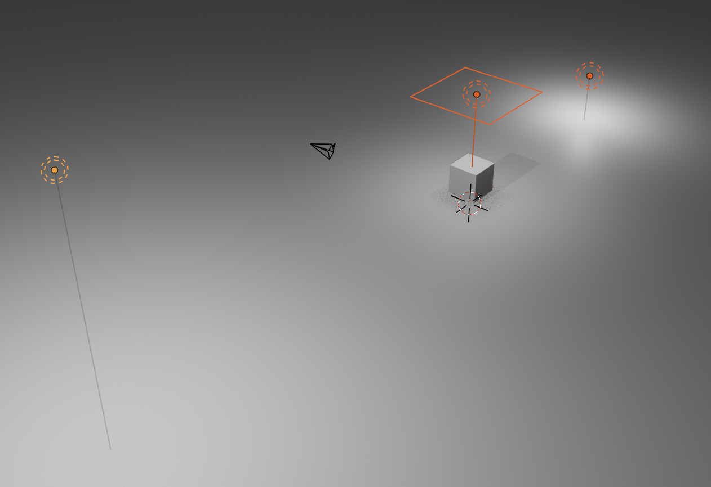

# Osvetlitev

**Namen poglavja:** spoznati osnovne vrste luči v Blenderju, kako jih pravilno uporabljamo, kakšne so razlike med njimi in kako postavimo osnovno **3‑točkovno osvetlitev**. Naučiš se tudi uporabljati **HDRI slike** za bolj realističen ambient.

---

## Vrste luči v Blenderju

Blender podpira več vrst luči. Vsaka se uporablja v različnih primerih:

| Tip luči     | Opis |
|--------------|------|
| **Point**    | Oddaja svetlobo enakomerno v vse smeri (npr. žarnica) |
| **Sun**      | Oddaja vzporedne žarke iz neskončne razdalje (npr. sonce) |
| **Spot**     | Stožčasta luč – svetloba le v določeno smer (odrska luč) |
| **Area**     | Pravokotna ali kvadratna svetlobna površina – mehkejše sence |

### Ključne lastnosti vsake luči:
- **Power (W)** – jakost svetlobe
- **Color** – barva
- **Size / Radius** – vpliva na mehkobo sence
- **Shadow** – ali luč oddaja sence

---

## Uporaba in postavitev luči

### Dodajanje luči:
`Shift + A → Light → [Point / Sun / Spot / Area]`

### Spreminjanje:
Izberi luč → *Light Properties* (ikona žarnice)

### Hitre spremembe:
- **G** za premik
- **R** za usmerjanje (Spot/Sun)
- **S** za povečanje območja (pri Area)

---

## Primer: 3‑točkovna osvetlitev

To je klasična metoda iz fotografije in filma.  
Uporablja tri luči za uravnoteženo osvetlitev objekta.

### 1. **Key Light** – glavna luč (najmočnejša)
- Tip: **Area** ali **Sun**
- Postavitev: spredaj, malo z boka
- Power: npr. 1000–2000W

### 2. **Fill Light** – zapolni sence
- Tip: **Area** ali **Point**
- Postavitev: nasproti Key, šibkejša
- Power: npr. 300–600W

### 3. **Back Light (Rim)** – iz ozadja, poudari robove
- Tip: **Spot** ali **Point**
- Postavitev: od zadaj ali strani, višje
- Power: npr. 500–800W

Spodaj je prikazana osnovna 3 točkovna postavitev. Najmočnejša luč je **Point** in je najbolj oddaljena. Dodani sta še
**Area** in šibkejša **Point** luč za zapolnitev senc in poudarjanje robov. Ko pogledamo skozi kamero, vidimo ravno
pravo postavitev.

{ width="70%" data-gallery="osvetlitev" }

!!! tip "Nasvet"
    Če sence izgledajo preostre, povečaj **Size** luči (pri Point/Area). Mehkejša svetloba deluje bolj naravno.

---

## HDRI – svetloba iz okolja

**HDRI (High Dynamic Range Image)** je 360° panorama, ki oddaja svetlobo.  
Uporablja se v **World Settings** za naravno svetlobno okolje.

### Koraki:
1. Odpri *World Properties* (ikona zemeljske krogle)
2. Klikni **Color → Environment Texture**
3. Klikni *Open* → izberi `.hdr` datoteko (npr. `studio_small.hdr`)
4. Vklopi **Scene World** v Material Preview (če želiš videti HDRI)

📥 Prenesi HDRI:  
- [polyhaven.com](https://polyhaven.com/hdris) (brezplačno)
- [hdrihaven.com](https://hdrihaven.com)

---

## Vaja: primerjava luči

1. Dodaj **UV sfero** in material (npr. kovinski)
2. Dodaj **Area Light** spredaj → nastavi **Power = 1500W**
3. Dodaj **Fill Light** z druge strani → Power = 500W
4. Dodaj **Back Light** → rahlo izza → Power = 700W
5. Renderiraj v **Cycles in Eevee** (primerjaj mehkobo in sence)
6. Odstrani vse luči → dodaj **HDRI** (npr. “sunny field”) → primerjaj rezultat

---

## Težave & rešitve

??? question "Objekt je pretemen"
    - Luč je morda prešibka → povečaj **Power**
    - Ali je svetlobni žarek usmerjen stran? Preveri rotacijo (Spot/Sun)
    - HDRI ni dovolj svetel? Dodaj **Strength** v Shader Editor → World

??? question "Sence so ostre ali umetne"
    - Povečaj **Size** luči (pri Point/Area)
    - Uporabi **Soft Shadows** (Eevee → Render Properties)

??? question "HDRI ne sveti ali se ne vidi"
    - Preveri, da si vklopil **Environment Texture**
    - V Material Preview vklopi **Scene World**
    - Morda je HDRI v Shader Editorju narobe povezan (Texture → Background → World Output)

---

## Rezultat

Znaš postaviti in prilagoditi različne luči, razumeš razliko med **Point**, **Sun**, **Spot** in **Area** ter znaš uporabiti **3-točkovno osvetlitev** ali **HDRI okolico** za realistične odboje. Si pripravljen/-a za zadnji korak – **renderiranje**.

[**Naprej → Kamera & render**](kamera-in-render.md){ .md-button .md-button--primary }
[← Nazaj: Eevee vs Cycles](eevee-vs-cycles.md){ .md-button }
